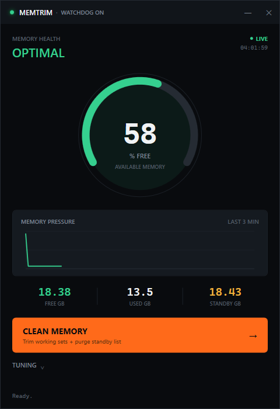

# MemTrim

A Windows RAM "cleaner" that only does the two things that actually work, instead of
the usual placebo-button nonsense.



## Why

Most RAM cleaners do nothing useful. Windows already caches unused memory (the
standby list) and hands it back instantly the moment something needs it. Forcing a
"clean" just throws that cache away and makes things slower for a bit afterward.

There's one real exception: purging the standby list right before loading something
memory-hungry, so the load isn't fighting cached pages for room. That's a real Windows
API (`NtSetSystemInformation` / `MemoryPurgeStandbyList`), the same one RAMMap and
ISLC use, just usually wired up to run way more often than it needs to.

MemTrim does that plus trimming idle processes' working sets and nothing else. No
"optimization," no fake progress bars.

Trimming a working set doesn't destroy anything: it hands pages back to Windows
immediately, and if that process touches them again later, they get faulted back in
from disk. That's a real, if small, one-time cost, not a free win every time.

## Install

Two ways to run this, same app either way:

**Just want it working:** grab the zip from the
[latest release](https://github.com/StrixEvo/MemTrim/releases/latest) (built from
this source with `build.ps1`, requires nothing but Windows to run), unzip it, and
double-click `Install.exe`.

**Want to read the code first, or don't trust a random exe:** that's a completely
reasonable position for something that touches admin-level memory APIs. Clone the
repo and run it straight from source (needs [PowerShell 7+](https://github.com/PowerShell/PowerShell),
`pwsh`, unlike the exe build):

```powershell
git clone https://github.com/StrixEvo/MemTrim.git
cd MemTrim
.\Install.ps1
```

Either way, install registers a background watchdog and drops a **Clean RAM Now**
shortcut on your desktop. The watchdog step needs an elevated PowerShell/prompt
(Windows won't register a "highest privileges" task otherwise). It'll warn you and
skip just that part if you're not elevated, so rerun it from an admin prompt. Only
want the dashboard, no watchdog? Run `Dashboard.ps1` (or `MemTrim.exe`) directly
instead of the installer.

The compiled exes are not a black box: they don't embed `Core.ps1`, they load it from
the same folder at runtime. Open `dist/Core.ps1` in a text editor and you're reading
the exact code `MemTrim.exe` runs, not a copy that might have drifted. See
[`build.ps1`](build.ps1) if you want to build `dist/` yourself instead of trusting a
download of it.

## Using it

Click **Clean Memory** whenever. Not running elevated? It still trims working sets;
the standby purge gets skipped, and the status line says so instead of pretending it
happened.

The watchdog sits in the background and only steps in when free RAM actually drops
below your threshold (12% by default), never on a timer. It also checks whether a
fullscreen app has focus before trimming, so it shouldn't interrupt a game or a race,
though that check is a best-effort heuristic (window bounds match the screen), not a
real exclusive-fullscreen API, so it can occasionally get it wrong on unusual setups.

Settings live in `config.json`, edited from the Tuning drawer in the dashboard. It's
gitignored so yours never end up in a commit; see `config.example.json` for the shape:

| Field | Default | What it does |
|---|---|---|
| `watchdogEnabled` | `true` | background auto-clean on/off |
| `thresholdPercent` | `12` | trigger when free RAM drops below this % |
| `checkIntervalSec` | `20` | how often the watchdog checks |
| `skipWhenFullscreen` | `true` | don't trim while a fullscreen app is focused |
| `excludeProcesses` | a few sim-racing games | processes the trimmer leaves alone; edit `config.json` to add your own, the drawer doesn't expose this list yet |

## How it actually works

`Invoke-MemTrimWorkingSets` in `Core.ps1` calls `EmptyWorkingSet` on background
processes above a size threshold, skipping the foreground app and your exclude list.
No admin needed for that part.

`Invoke-MemTrimStandbyPurge` enables `SeProfileSingleProcessPrivilege` and calls
`NtSetSystemInformation(SystemMemoryListInformation, MemoryPurgeStandbyList)`. That one
needs admin. It's a real Windows requirement, not something I bolted on.

The dashboard's "Cache GB" reading comes from `PERFORMANCE_INFORMATION.SystemCache`,
which is Windows' broader system-cache figure (standby list plus modified page list),
not an isolated count of only the standby list that the purge above targets. It's
labeled "Cache," not "Standby," for that reason.

The watchdog (`Watchdog.ps1`) runs at `BelowNormal` priority and won't trim again
within 2 minutes of the last time, no matter how aggressive you set the threshold.

It's touching low-level memory APIs, so read `Core.ps1` before running it if you want
to know exactly what it does. It's short.

## Uninstall

`Uninstall.exe`, or `.\Uninstall.ps1` from source. Removes the scheduled task and the
desktop shortcut. `Logs/` and `config.json` stick around; delete the folder yourself
if you want it fully gone.

## Layout

```
Core.ps1               memory engine: trim/purge/status, no UI
Dashboard.ps1          the WPF window
Watchdog.ps1           background loop, installed by Install.ps1
Install.ps1 / Uninstall.ps1
build.ps1              compiles the above into dist/*.exe (ps2exe)
config.example.json
assets/icon.ico        + make-icon.ps1 to regenerate it
```

## License

MIT, see [LICENSE](LICENSE).
